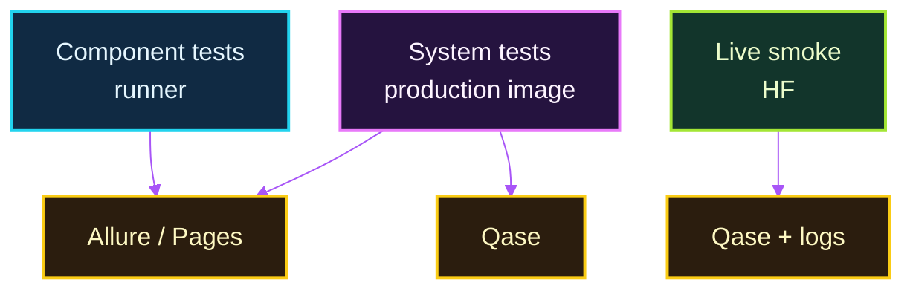

# Event Agent

Event Agent is a scheduled Python 3.13 job that finds nearby Ticketmaster events,
selects a short list with an OpenAI agent, adds available ticket prices, and sends
the result to Telegram. It replaces manual event searching and avoids repeating
recommendations already delivered.

The LLM selects and explains events; deterministic code controls event IDs,
prices, delivery, and history.

## How it works


The architecture separates probabilistic event selection from deterministic filtering, pricing, delivery, and persistence. See the [full architecture](docs/architecture.md) for the daily-run and Hugging Face runtime diagrams.

### Daily execution

```text
Hugging Face Jobs / Docker -> daily.py -> load /app/data/seen_events.json
  -> Ticketmaster Discovery API (paginate; filter seen and canceled events)
  -> OpenAI Responses API (tool loop; select grounded recommendations)
  -> deterministic price enrichment -> Camoufox -> Ticketmaster ticket pages
       HF browser traffic: local SOCKS5 -> Tailscale -> Raspberry Pi exit node
  -> deterministic Telegram HTML -> Telegram API
  -> save recommended IDs to /app/data/seen_events.json after successful delivery
```

The daily flow persists recommended IDs only after Telegram delivery succeeds.

The Discovery API supplies candidate events. The agent can call tools and
continue its Responses API conversation, but can recommend only IDs grounded by
successful tool results. After selection, Camoufox scrapes visible prices for
final Ticketmaster recommendations only. On Hugging Face, Tailscale userspace
networking routes Camoufox through the Raspberry Pi/home-network exit IP; local
runs need no proxy. A persistent `/app/data` mount retains `seen_events.json`
between jobs.

## Quality and testing

- The ISTQB-aligned test strategy separates Component, Component Integration,
  System, and System Integration Testing. Component and Component Integration
  Testing has 183 deterministic checks; seven black-box System Tests exercise
  the exact production container; four live System Integration smoke checks run
  separately on Hugging Face.
- Search paginates past previously seen events (up to five API pages), returns
  at most ten eligible candidates, and filters canceled events before the model
  sees them. Same-run duplicates and previously delivered IDs are also filtered.
- Model-visible search results omit `Admission` and price fields. The LLM is not
  a pricing authority: deterministic provider data or post-selection scraping
  determines the final price. Missing price means unknown, not free admission.
- Scraper failures are isolated per recommendation and preserve any existing
  provider `Admission`; they do not fail the daily run.
- History stores recommended IDs only after Telegram delivery succeeds.
- Component and Component Integration tests use no real OpenAI, Ticketmaster,
  Telegram, or browser calls. The Allure CI report combines their 183 results
  with seven System Test results; Qase tracks the seven System and four live
  System Integration scenarios.



See the [testing strategy](docs/TESTING.md) for levels, markers, black-box
architecture, reporting, and local commands.

## Local development

```bash
python3.13 -m venv .event-agent-venv
source .event-agent-venv/bin/activate
pip install -r requirements-test.txt
pytest -q tests/component tests/component_integration
python -m camoufox fetch
cp .env.example .env  # fill in local credentials before running the job
python src/daily.py
```

Camoufox runs headed. On a headless Linux host, use
`xvfb-run -a python src/daily.py`. Tests need neither browser download nor
application secrets. The scraper uses a bounded, non-fatal readiness wait for
Ticketmaster content rather than a fixed post-navigation sleep.

## Observability

Application logs are ECS-compatible JSON on stdout. When both
`ELASTIC_OTLP_ENDPOINT` and `ELASTIC_API_KEY` are configured, the same Python
logs are also exported directly to Elastic Managed OTLP/HTTP through
OpenTelemetry. Export is optional and logs-only; metrics, traces, and a
Collector are not configured.

Structured records include a successful `daily_run` summary (duration and
seen/recommended/saved counts), `ticketmaster_event_search` pagination counts,
and `ticketmaster_price_scrape` outcomes, reasons, and extraction diagnostics.
These fields are suitable for an Elastic dashboard; this repository does not
ship a dashboard definition.

## Deployment

GitHub Actions tests the project and publishes a Docker image to GHCR. The
image includes Camoufox, Xvfb, and Tailscale; its default command runs the
daily job without Tailscale. For a local container run:

```bash
docker build -t event-agent:local .
docker run --rm --env-file .env -v "$PWD/data:/app/data" event-agent:local
```

### Hugging Face runtime

Hugging Face Jobs can schedule the image with `/app/scripts/run_hf.sh` as its
command and persistent `/app/data` storage. The wrapper starts Tailscale in
userspace mode, connects to the Raspberry Pi exit node, sets a loopback SOCKS5
proxy for Camoufox, and runs the job through Xvfb. Keep credentials in runtime
secrets, not the image: the application needs OpenAI, Ticketmaster, and Telegram
credentials; the HF wrapper additionally needs `TAILSCALE_AUTHKEY` and
`TAILSCALE_EXIT_NODE`. Elastic export is optional. See the sanitized
[configuration template](.env.example) and [operations runbook](docs/OPERATIONS.md)
for settings and the HF Jobs command.

Only Camoufox traffic is routed through Tailscale and the Raspberry Pi exit node; the [full runtime diagram](docs/architecture.md#deployment-status) shows the boundary.

## More detail

- [Architecture](docs/architecture.md)
- [Engineering rules](docs/engineering-rules.md)
- [Operations](docs/OPERATIONS.md)
- [Contributor instructions](AGENTS.md)
