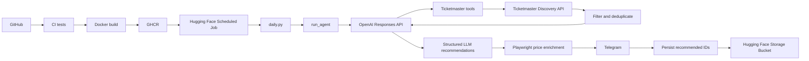

# Architecture

## System Overview

The application is a scheduled Python event discovery agent. GitHub Actions runs tests, builds the Docker image, and publishes it to GHCR. A Hugging Face scheduled Job runs that image, with secrets injected at runtime and `/app/data` backed by a Hugging Face Storage Bucket.

The container starts `src/daily.py`. The entry point loads event history, runs the agent through the OpenAI Responses API and Ticketmaster Discovery API tools, parses structured recommendations, enriches Ticketmaster recommendations with prices through Playwright, formats and sends the report to Telegram, then persists only the recommended event IDs.



## High-Level Flow

```text
GitHub
  -> CI tests
  -> Docker build
  -> GHCR

Hugging Face Scheduled Job
  -> Docker container
  -> daily.py
  -> run_agent()
  -> OpenAI tool calls
  -> Ticketmaster Discovery API
  -> filtering/deduplication
  -> structured LLM recommendations
  -> Playwright Ticketmaster price enrichment
  -> Telegram
  -> persist recommended event IDs
```

`daily.py` saves history only after Telegram delivery succeeds. A Telegram failure therefore prevents the current run's recommended event IDs from being marked as delivered.

## Module Responsibilities

- `src/daily.py`: Application entry point. Configures logging, loads history, runs the agent, enriches prices, prints and sends the report, and saves history.
- `src/agent.py`: OpenAI conversation orchestration and runtime dependency wiring. It creates service clients and runs the function-call loop, but does not implement Ticketmaster or define tool schemas.
- `src/config.py`: Loads and validates required environment variables into the frozen `Settings` dataclass.
- `src/models.py`: Defines the `Admission`, `Event`, `EventDetails`, and `Recommendation` dataclasses.
- `src/history.py`: Loads, validates, filters, and atomically saves seen event IDs in `data/seen_events.json`.
- `src/telegram_formatter.py`: Formats and escapes deterministic Telegram HTML.
- `src/telegram_notifier.py`: Sends a message through the Telegram Bot API.
- `src/ticketmaster_enrichment.py`: Applies scraped Ticketmaster admission data to final recommendations.
- `src/tools/registry.py`: Defines the OpenAI tool schemas, creates handlers, and dispatches tool calls.
- `src/tools/ticketmaster.py`: Implements Ticketmaster HTTP requests and maps responses to event dataclasses.
- `src/tools/ticketmaster_price_scraper.py`: Extracts visible Ticketmaster prices with Playwright while reusing its browser context.

## Agent Loop

1. `run_agent()` loads `Settings`, creates a `TicketmasterClient` with the configured `SearchLocation`, creates tool handlers and definitions, and sends the initial user request to the OpenAI Responses API.
2. The response is inspected for `function_call` items.
3. Each call's JSON arguments are parsed and dispatched through the tool registry.
4. `search_events` results are filtered and serialized. Tool failures become error payloads returned to the model.
5. Results are sent back as `function_call_output` items in a follow-up Responses API request.
6. The loop repeats until the model response contains no function calls.
7. The final model response is structured JSON containing at most seven recommendations. Each recommendation includes an event ID grounded by a successful tool call. `run_agent()` parses it into `Recommendation` objects and returns only the recommended event IDs for persistence; `known_event_admissions` remains internal to the run.

`daily.py` first passes final recommendations through `ticketmaster_enrichment.py`. Successful Playwright scrapes replace their admission data, while unavailable or failed scrapes preserve existing provider admission. It then passes the recommendations to `telegram_formatter.py`, which owns deterministic Telegram HTML formatting and escaping. The model does not generate Telegram HTML or Markdown.

## Event Deduplication

`search_events` queries Ticketmaster around the configured base location using its `geoPoint` and radius. The base location is configuration, not an LLM tool argument.

`seen_event_ids` contains IDs loaded from previous scheduled runs. It prevents events already delivered in an earlier run from being sent again.

`known_event_admissions: dict[str, Admission | None]` starts empty for each agent run. Its keys are the single source of truth for event IDs grounded during the run, and its values preserve provider-authoritative admission data. After each successful `search_events` call, results are filtered against:

```python
seen_event_ids | known_event_admissions.keys()
```

This prevents duplicates both across scheduled runs and between multiple searches in the same run. Only remaining events are sent to the model and recorded as `event.id -> event.admission`. A successful `get_event_details` call grounds its event ID with `setdefault(event_id, None)`, so it never overwrites admission discovered by search. Final recommendation IDs must exist in this mapping, and their admission is always taken from it rather than from the model. The selected IDs are exposed as `recommended_event_ids` and are the only IDs persisted.

## Configuration Flow

`config.load_settings()` calls `load_dotenv()` and reads the required environment variables into `Settings`, including a `SearchLocation` with the base location name, Ticketmaster geohash, and search radius. Runtime secrets are injected by the execution environment. The agent passes the Ticketmaster API key and location configuration to `TicketmasterClient`; location configuration values are not LLM tool arguments.

No secrets are copied into or stored in the Docker image.

## Persistence

The container's `/app/data` directory is mounted from a Hugging Face Storage Bucket. `history.py` uses `data/seen_events.json` as the history file.

- Missing history starts as an empty set.
- Valid history is a JSON list of string event IDs.
- Saves write a sorted list to a temporary file and atomically replace the target.
- `daily.py` saves the union of prior and newly recommended IDs only after successful Telegram delivery.

## Testing Architecture

Unit tests mock the OpenAI client and Responses API, Ticketmaster HTTP requests, Playwright browser behavior, and Telegram delivery. They do not make real external API calls and run without application secrets. Tests cover the agent loop, tool dispatch, filtering across and within runs, price extraction and enrichment, configuration validation, history persistence, and daily delivery ordering.

## Design Principles

- Keep modules small and responsibility-focused.
- Use dependency injection at external-service boundaries where useful.
- Keep external integrations isolated from orchestration.
- Prefer standard-library mechanisms and small functions.
- Avoid unnecessary frameworks and abstractions.
