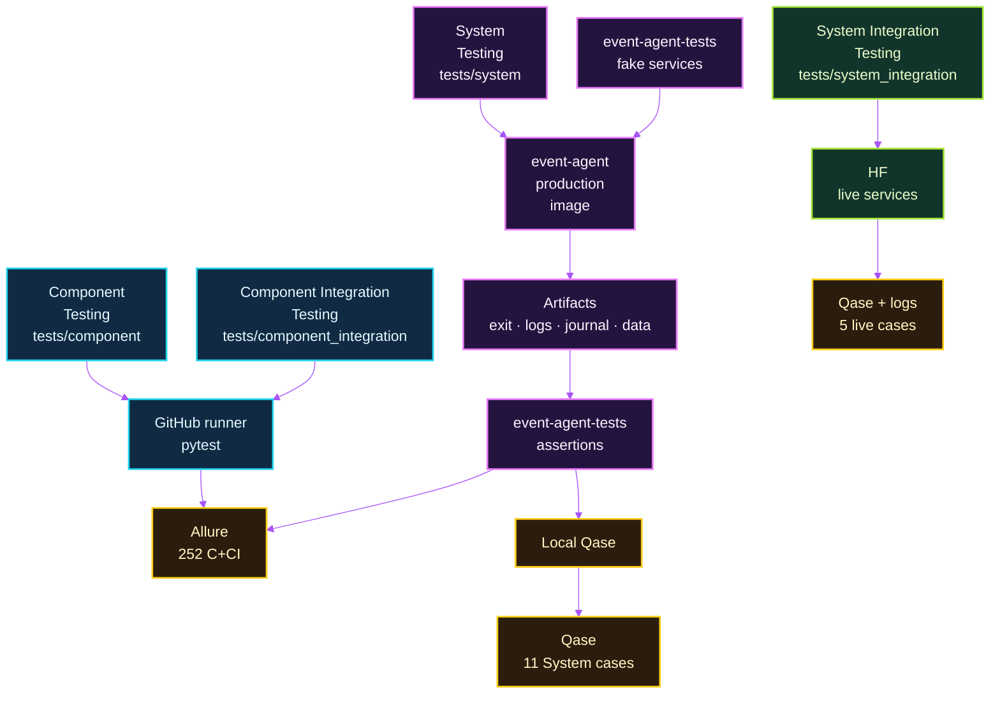
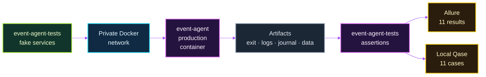
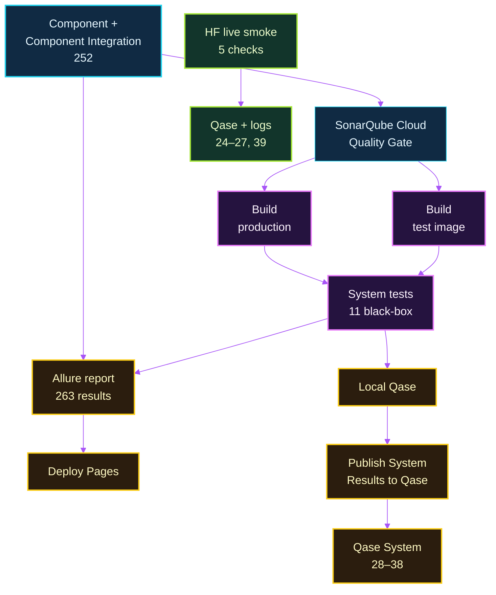

# Testing Strategy

Event Agent uses several test levels so that fast checks of individual
components, in-process collaboration checks, production-container behavior, and
live external-service checks each have an appropriate execution environment.
The separation keeps normal CI deterministic while preserving a small set of
high-value black-box and live checks.

## Test Levels

| ISTQB level | Location | Test object and dependencies | Execution | Examples |
| --- | --- | --- | --- | --- |
| Component Testing | `tests/component/` | Individual application components and deterministic helpers; dependencies are mocked or faked. | GitHub runner and local pytest. | Ticketmaster response mapping, price parsing, Telegram formatting, history validation. |
| Component Integration Testing | `tests/component_integration/` | Collaboration between application components while external boundaries remain mocked or faked. | GitHub runner and local pytest. | Daily delivery-before-persistence ordering, enrichment with the formatter, ECS/OTLP logging lifecycle. |
| System Testing | `tests/system/` | The exact `event-agent` production image, treated as a black box. | Local Docker orchestration and GitHub Actions. | Happy path, Telegram failure, no events, seen-event filtering, canceled-event filtering, OpenAI failure, multiple candidates, Ticketmaster failure, ungrounded recommendation, mixed-source discovery, partial source failure. |
| System Integration Testing | `tests/system_integration/` plus the production-image MOSiR probe | Live connectivity to external systems. | Explicit Hugging Face smoke run. | Four pytest checks in the source-free test image (Ticketmaster API, Camoufox, Telegram, Elastic) plus one MOSiR live probe in the production image. |

Component and Component Integration Testing together currently contain 252
tests. System Testing contains eleven black-box scenarios. System Integration
Testing contains five logical live checks: four pytest checks in the source-free
test image and one MOSiR probe in the production image. The current Python
coverage baseline for `src/` is 94%.

## Test Purpose and Execution Markers

A test level answers *what scope is being tested*. A marker describes a selected
purpose or execution characteristic; it is not a test level.

| Marker | Meaning | Current use |
| --- | --- | --- |
| `smoke` | Fast availability check for a critical external integration. | The five System Integration checks. |
| `live` | Calls a real external service rather than a mock or fake. | The same five System Integration checks. |

Qase is not a pytest level or marker. `@qase.id(...)` provides only
traceability from a representative pytest scenario to a Qase case.

## Execution Model



Component and Component Integration tests run directly on the GitHub runner.
The source-free `event-agent-tests` image contains pytest, Qase and Allure
tooling, `tests/system/`, `tests/system_integration/`, and the required test
support modules; it deliberately does not contain `/app/src`. The separate
`event-agent` image is the production system under test.

System Tests use `SystemScenario` as a small Test Driver/Scenario Driver: one
typed definition describes the fake Ticketmaster, MOSiR, OpenAI, Telegram, and
history world. Fake services implement that world; the shell harness controls
Docker and artifacts; assertions inspect only black-box outcomes such as exit
status, logs, journal requests, Telegram delivery, and `/app/data`.

## Code Coverage

Component and Component Integration Testing generates branch-aware Python
coverage for `src/` in `coverage.xml`. System Testing remains black-box and
does not contribute to that coverage report.

## SonarQube Cloud

SonarQube Cloud imports `coverage.xml` for static code-quality and security
analysis. The CI sequence is Component + Component Integration Testing,
coverage generation, SonarQube Cloud analysis and Quality Gate, then Docker
image builds and System Testing. A failed Quality Gate blocks both image
builds. System Testing remains black-box and is not a source of code coverage.
Qase publication remains an independent, non-blocking reporting step.

## System Testing Architecture

System Testing does not import or patch application code. The host orchestrates
two images on a private Docker network; the assertion container itself has no
network access.



The eleven deterministic scenarios cover:

1. successful delivery and persistence;
2. Telegram failure without history persistence;
3. explicit no-events notification;
4. filtering an already seen event;
5. canceled-event filtering;
6. OpenAI failure without partial delivery or history; and
7. persistence of only the delivered recommendation from multiple candidates;
8. Ticketmaster Discovery failure without delivery or history persistence; and
9. rejection of an ungrounded recommendation before delivery; and
10. mixed-source discovery with conservative cross-source deduplication and
    namespaced MOSiR persistence; and
11. partial source failure with delivery from the available MOSiR source.

## Reporting and Traceability



Allure is the technical report for every automated test executed by GitHub CI:
252 Component and Component Integration results plus eleven System results, for
263 results in the final report. System Integration live smoke checks are not
run in GitHub CI and are therefore not added to that report; their execution
details remain in Hugging Face logs.

Qase is the high-level QA traceability layer. System Tests generate their local
Qase report during the same network-isolated pytest execution that creates
Allure results. The GitHub runner later imports that saved report, so Qase does
not require a second execution. Qase publication is intentionally non-blocking
and does not gate Allure or GitHub Pages deployment.

The active Qase catalog is:

- System Integration: IDs 24–27 for the four pytest live checks and ID 39 for
  the MOSiR production-image probe.
- System: IDs 28–38 for the eleven black-box System scenarios.
- IDs 1–23: retained as `Deprecated` historical cases; they have no active
  pytest traceability.

The catalog contains 39 cases in total, with 16 active high-level cases.

No reporting screenshots are committed; live evidence remains in the Allure,
Qase, and GitHub Actions services.

## Running Tests Locally

Activate the repository virtual environment first:

```bash
source .event-agent-venv/bin/activate
```

Run a single local level or the CI-equivalent local selection:

```bash
pytest -q tests/component
pytest -q tests/component_integration
pytest -q tests/component tests/component_integration
```

Run black-box System Tests. Docker builds both local images unless the script is
configured to use pre-built images:

```bash
./scripts/run_system_tests.sh
```

Collect the live System Integration suite without calling external services:

```bash
pytest --collect-only -q tests/system_integration
```

Run the four pytest live smoke checks only with intentional opt-in and the required
runtime configuration:

```bash
pytest --run-smoke -m "smoke and live" -q tests/system_integration
```

For the supported routed live execution, use the Hugging Face runtime commands
in [Operations](OPERATIONS.md#docker).
