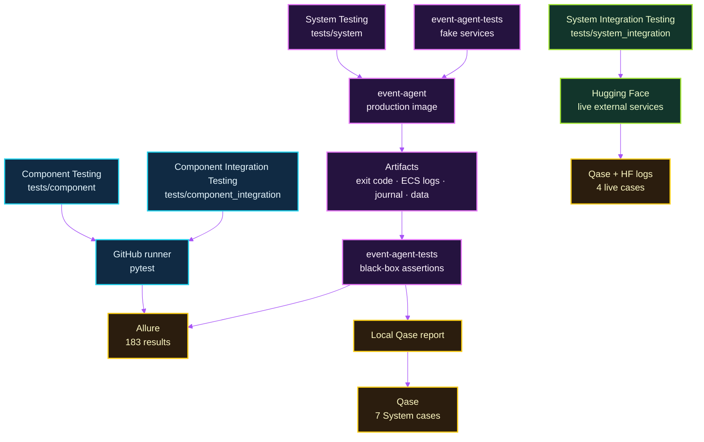
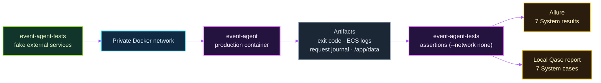
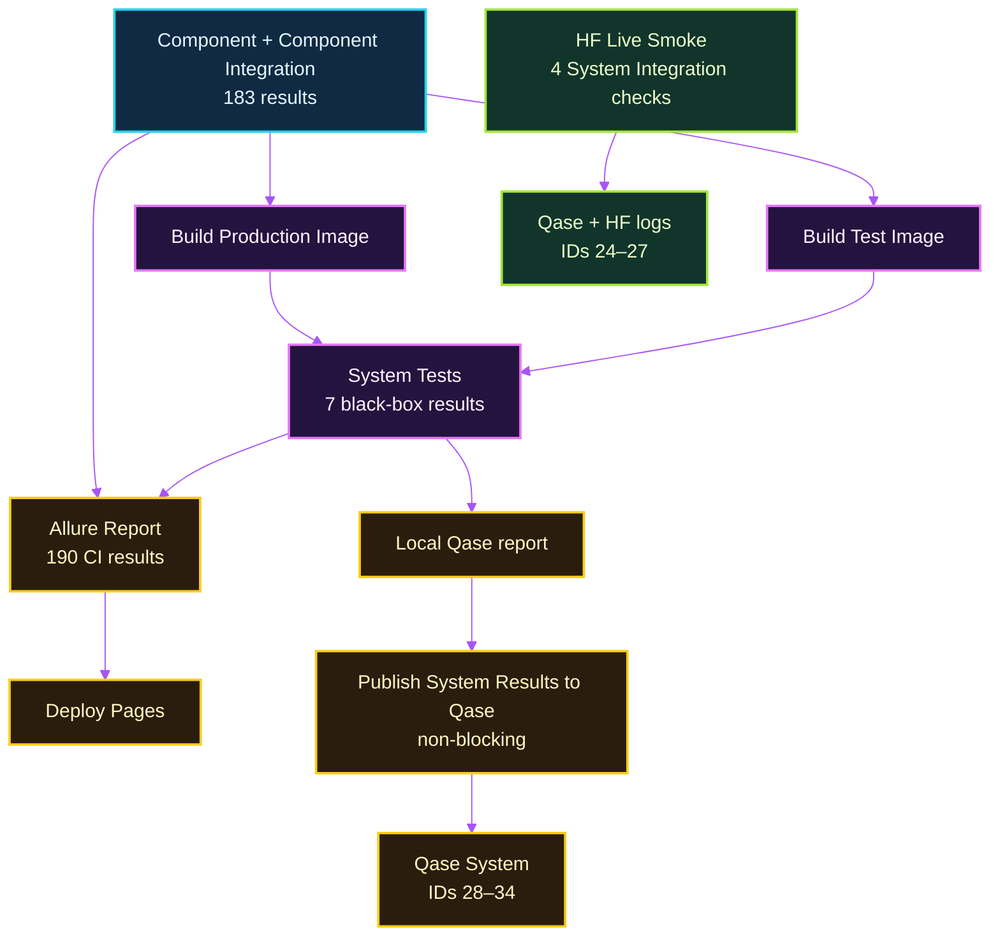

# Testing Strategy

Event Agent uses several test levels so that fast checks of individual
components, in-process collaboration checks, production-container behavior, and
live external-service checks each have an appropriate execution environment.
The separation keeps normal CI deterministic while preserving a small set of
high-value black-box and live checks.

## Test Levels

| ISTQB level | Location | Test object and dependencies | Execution | Examples |
| --- | --- | --- | --- | --- |
| Component Testing | `tests/component/` | Individual application components and deterministic helpers; dependencies are mocked or faked. | GitHub runner and local pytest. | Ticketmaster response mapping, price parsing, Telegram formatting, history validation. |
| Component Integration Testing | `tests/component_integration/` | Collaboration between application components while external boundaries remain mocked or faked. | GitHub runner and local pytest. | Daily delivery-before-persistence ordering, enrichment with the formatter, ECS/OTLP logging lifecycle. |
| System Testing | `tests/system/` | The exact `event-agent` production image, treated as a black box. | Local Docker orchestration and GitHub Actions. | Happy path, Telegram failure, no events, seen-event filtering, canceled-event filtering, OpenAI failure, multiple candidates. |
| System Integration Testing | `tests/system_integration/` | Live connectivity to external systems through the test runtime. | Explicit Hugging Face smoke run. | Ticketmaster Discovery API, Ticketmaster reached through Camoufox, Telegram `getMe`, Elastic OTLP ingestion. |

Component and Component Integration Testing together currently contain 183
tests. System Testing contains seven black-box scenarios. System Integration
Testing contains four live smoke checks.

## Test Purpose and Execution Markers

A test level answers *what scope is being tested*. A marker describes a selected
purpose or execution characteristic; it is not a test level.

| Marker | Meaning | Current use |
| --- | --- | --- |
| `regression` | Stable local regression subset. | 23 selected Component or Component Integration tests. |
| `smoke` | Fast availability check for a critical external integration. | The four System Integration checks. |
| `live` | Calls a real external service rather than a mock or fake. | The same four System Integration checks. |

Qase is not a pytest level or marker. `@qase.id(...)` provides only
traceability from a representative pytest scenario to a Qase case.

## Execution Model



Component and Component Integration tests run directly on the GitHub runner.
The source-free `event-agent-tests` image contains pytest, Qase and Allure
tooling, `tests/system/`, `tests/system_integration/`, and the required test
support modules; it deliberately does not contain `/app/src`. The separate
`event-agent` image is the production system under test.

## System Testing Architecture

System Testing does not import or patch application code. The host orchestrates
two images on a private Docker network; the assertion container itself has no
network access.



The seven deterministic scenarios cover:

1. successful delivery and persistence;
2. Telegram failure without history persistence;
3. explicit no-events notification;
4. filtering an already seen event;
5. canceled-event filtering;
6. OpenAI failure without partial delivery or history; and
7. persistence of only the delivered recommendation from multiple candidates.

## Reporting and Traceability



Allure is the technical report for every automated test executed by GitHub CI:
183 Component and Component Integration results plus seven System results, for
190 results in the final report. System Integration live smoke checks are not
run in GitHub CI and are therefore not added to that report; their execution
details remain in Hugging Face logs.

Qase is the high-level QA traceability layer. System Tests generate their local
Qase report during the same network-isolated pytest execution that creates
Allure results. The GitHub runner later imports that saved report, so Qase does
not require a second execution. Qase publication is intentionally non-blocking
and does not gate Allure or GitHub Pages deployment.

The active Qase catalog is:

- System Integration: IDs 24–27 for the four live smoke checks.
- System: IDs 28–34 for the seven black-box System scenarios.
- IDs 1–23: retained as `Deprecated` historical cases; they have no active
  pytest traceability.

## Evidence / Reporting Screenshots

No reporting screenshots are committed yet. When capturing real evidence, add
the image under `docs/images/screenshots/` and replace the corresponding
placeholder with a linked image.

| Evidence | Suggested file | Capture should show |
| --- | --- | --- |
| Allure | `docs/images/screenshots/allure-ci-report.png` | Component Testing, Component Integration Testing, and the seven System Testing results in the same CI report. |
| Qase | `docs/images/screenshots/qase-active-cases.png` | The 11 active high-level cases: seven System and four System Integration. |
| GitHub Actions | `docs/images/screenshots/github-actions-ci.png` | Component + Component Integration Tests, both image builds, System Tests, Allure, Pages, and non-blocking Qase publication. |

Do not add placeholder image files: screenshots should document an actual run,
not a mocked UI.

## Running Tests Locally

Activate the repository virtual environment first:

```bash
source .event-agent-venv/bin/activate
```

Run a single local level or the CI-equivalent local selection:

```bash
pytest -q tests/component
pytest -q tests/component_integration
pytest -q tests/component tests/component_integration
```

Run the retained local regression subset:

```bash
pytest -m regression -q
```

Run black-box System Tests. Docker builds both local images unless the script is
configured to use pre-built images:

```bash
./scripts/run_system_tests.sh
```

Collect the live System Integration suite without calling external services:

```bash
pytest --collect-only -q tests/system_integration
```

Run the four live smoke checks only with intentional opt-in and the required
runtime configuration:

```bash
pytest --run-smoke -m "smoke and live" -q tests/system_integration
```

For the supported routed live execution, use the Hugging Face runtime commands
in [Operations](OPERATIONS.md#docker).
