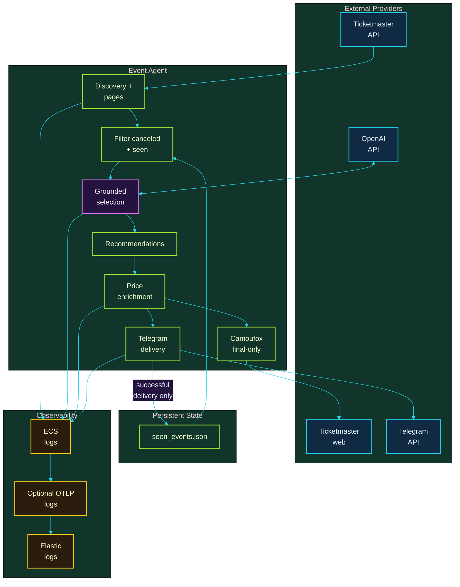
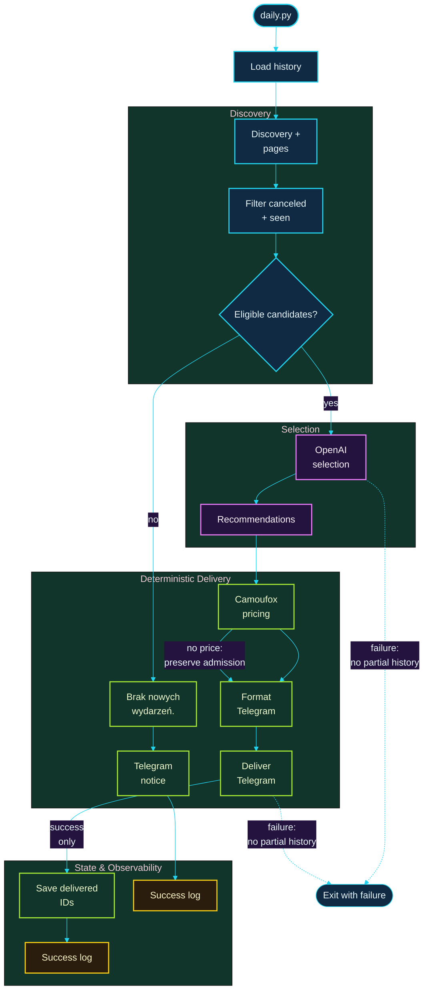
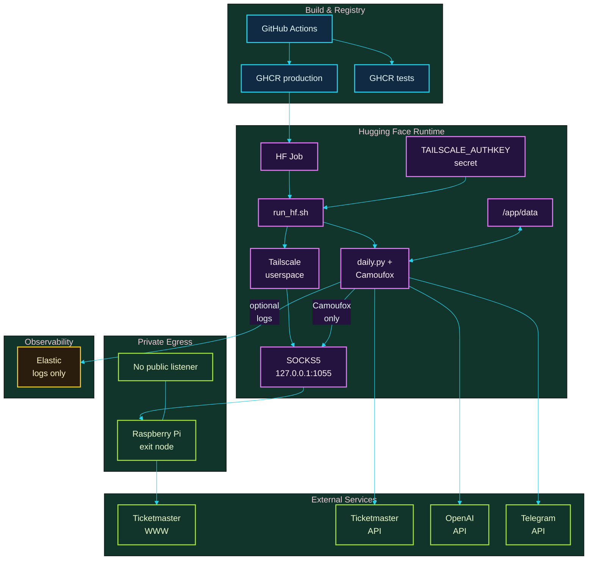

# Architecture

## Goals

Event Agent is a scheduled batch application that finds nearby Ticketmaster
events, asks an OpenAI agent to choose a small set of grounded recommendations,
enriches only those choices with deterministic ticket pricing, sends one
Telegram report, and records the delivered recommendation IDs.

The design makes the boundary between probabilistic selection and deterministic
system behavior explicit. It is intentionally small: one discovery provider,
one browser backend, synchronous execution, and at most seven recommendations
per run. Each Ticketmaster search supplies at most ten eligible unseen
candidates to the agent.

## Non-goals

- A long-running web service or public API
- Generic provider or browser frameworks without a current requirement
- LLM-authored prices, delivery markup, or persistence decisions
- Scraping every discovered event
- Generic proxy-provider abstractions, custom anti-bot, or CAPTCHA handling
- Live external-service calls in the default test suite

## System Overview

The application keeps probabilistic selection separate from deterministic
filtering, price enrichment, delivery, and persistence.



Only the OpenAI selection step is probabilistic; provider data, price handling,
delivery, history, and log export are deterministic application behavior.

## End-to-end Flow

One `daily.py` execution branches explicitly when discovery yields no eligible
new events; it otherwise delivers only grounded final recommendations.



Price scraping is non-fatal and missing price data is never treated as free;
history changes only after a successful recommendation delivery.

## Module Responsibilities

| Module | Responsibility |
| --- | --- |
| `src/daily.py` | Compose one scheduled run and enforce delivery-before-persistence ordering. |
| `src/agent.py` | Orchestrate OpenAI Responses calls, execute tools, filter candidates, ground IDs, and validate structured recommendations. |
| `src/models.py` | Define shared event, admission, and recommendation dataclasses. |
| `src/config.py` | Read and validate environment configuration. |
| `src/history.py` | Load, validate, filter, and atomically persist seen event IDs. |
| `src/logging_config.py` | Configure ECS JSON stdout logging and the optional direct OTLP log-export lifecycle. |
| `src/tools/registry.py` | Define the model-visible tools and dispatch them to configured handlers. |
| `src/tools/ticketmaster.py` | Call the Ticketmaster Discovery API and map responses into domain models. |
| `src/tools/ticketmaster_price_scraper.py` | Own Camoufox and extract visible PLN prices from Ticketmaster pages. |
| `src/ticketmaster_enrichment.py` | Apply deterministic post-selection price enrichment while isolating scraper failures. |
| `src/telegram_formatter.py` | Render escaped, deterministic Telegram HTML. |
| `src/telegram_notifier.py` | Deliver the message through the Telegram Bot API. |
| `scripts/run_hf.sh` | Establish Hugging Face Tailscale egress and start the headed daily process. |

`src/agent.py` does not know how browser scraping works, and the scraper does
not know about agent conversations or Telegram. `src/daily.py` is the small
composition root that sequences these boundaries.

## Application Logging

The ECS JSON stdout handler is always active and retains stable service
metadata. When both `ELASTIC_OTLP_ENDPOINT` and `ELASTIC_API_KEY` are present,
`src/logging_config.py` also attaches one OpenTelemetry logging handler backed
by a batch processor and a direct OTLP/HTTP exporter to Elastic Managed OTLP.
The endpoint is non-secret configuration; the API key is a secret and is never
written to logs.

Structured records expose the boundaries of a run without full event payloads:

- A successful `daily_run` record is emitted after Telegram delivery and
  history persistence with duration, seen-loaded, recommended, and seen-saved
  counts.
- `ticketmaster_event_search` records API pages fetched, API events returned,
  and unseen eligible events returned to the agent; canceled events also emit
  `ticketmaster_event_filter` records with the dropped event ID.
- `ticketmaster_price_scrape` records outcome, failure reason when applicable,
  elapsed time, page language, ticket marker, direct-price count, and whether a
  best-available control was found. Successful extraction also records the
  price range and currency.

`src/daily.py` shuts down the logging pipeline in its final cleanup so the
short-lived job can flush batch-exported records. Missing, partial, or failing
telemetry configuration cannot change delivery or persistence behavior. This
integration covers logs only: it uses no OpenTelemetry Collector,
auto-instrumentation, metrics, or traces.

## Probabilistic vs Deterministic Boundary

| Probabilistic LLM responsibility | Deterministic application responsibility |
| --- | --- |
| Choose and rank interesting grounded events. | Discover provider events through registered tools. |
| Produce model-authored display fields—name, category, date, time, city, venue, reason, and URL—in a strict schema. | Filter seen and repeated IDs, validate grounding, and cap the result count. |
| Decide whether another tool call is useful. | Own all `Admission` data and browser price extraction. |
|  | Escape and format Telegram HTML. |
|  | Deliver the report and persist selected IDs only after success. |

The recommendation response schema deliberately excludes `admission`. Even if
model output attempted to include it, strict schema validation rejects the
field, and application parsing injects the provider-authoritative value.
Successful search results have two representations: the internal Event's
Admission is stored in `known_event_admissions`, while the fresh dictionary sent
to OpenAI has its top-level `admission` field removed. Structured provider
pricing therefore never reaches the model.

Together, tool-output redaction and deterministic parser injection prevent the
model from becoming Admission authority. Permanent agent instructions also
prohibit mentioning, inventing, inferring, estimating, or reproducing prices.
The remaining display fields are model-authored free text and are not
cross-checked against the provider response.

## OpenAI Responses API Tool Loop

The agent creates an initial Responses API request with permanent instructions,
the Ticketmaster tool definitions, and a strict JSON response schema. While the
response contains function calls, it:

1. Parses the tool arguments.
2. Dispatches through `src/tools/registry.py`.
3. Applies grounding and deduplication state only after successful execution.
4. Serializes a sanitized model-visible view; search Event dictionaries omit
   `admission` and its nested price data.
5. Sends function-call outputs in a continuation request using
   `previous_response_id` and the same instructions, tools, and response format.

Tool errors are returned to the model so the conversation can recover. The
generic loop forwards the handler's exception message, so sanitization belongs
at each provider boundary. Ticketmaster HTTP failures are sanitized before they
reach that model-visible payload. A failed tool call does not ground an event
ID. Malformed tool arguments retain their existing fatal behavior.

## Ticketmaster Discovery and Eligibility

Each `search_events` request asks Ticketmaster for ten events per API page.
The provider accumulates at most ten distinct eligible unseen events, advancing
past pages dominated by previously seen IDs. It stops when it has ten results,
Ticketmaster's pagination metadata reports no further page, or it reaches the
five-page safety limit. If usable `totalPages` metadata is absent, a short page
also ends pagination. The agent applies its own seen-ID and same-run filters
before serializing at most ten events into each model-visible tool result.

An event with `dates.status.code == "canceled"` is discarded before grounding
or model exposure; a canceled detail lookup is rejected too. Other statuses,
including postponed and rescheduled, are not excluded solely for their status.
Successful search output is price-free, while provider `Admission` remains in
private agent state for deterministic use after selection. The seven-item cap
applies to final recommendations, not to search candidates.

## Grounding and `known_event_admissions`

`known_event_admissions: dict[str, Admission | None]` is the agent run's single
source of truth for both grounding and provider admission data:

- Search results are filtered against previously seen IDs and existing mapping
  keys, preserving cross-run and same-run deduplication.
- Each remaining unseen search result adds its event ID and provider
  `Admission` value.
- The model receives a price-free projection of that Event; the mapping remains
  private to deterministic orchestration.
- A successful `get_event_details` call adds the requested ID with
  `setdefault(event_id, None)`, so it never erases an Admission already obtained
  from search.
- Final recommendation IDs must be keys in the mapping. Unknown IDs are rejected.
- Recommendation parsing injects the mapped Admission, so the LLM can never
  become the pricing authority.

`AgentRunResult.recommended_event_ids` contains only the IDs in the final
recommendations. Discovered but unselected IDs are not persisted.

## Admission Authority and Price Enrichment

`Admission` is provider-owned data. Ticketmaster API price ranges may establish
an initial value during discovery. After the LLM selects recommendations,
`src/ticketmaster_enrichment.py` processes only final recommendations whose URL
belongs to `ticketmaster.pl` or one of its subdomains.

- A successful scrape replaces the existing Admission with the visible provider
  price range.
- A scrape that returns `None` means pricing is unavailable; it does not mean the
  event is free.
- A malformed or non-Ticketmaster URL is skipped.
- Scraper setup and individual page failures preserve existing Admission data
  and do not fail the daily run.
- Enrichment mutates the recommendation objects in place and returns the same
  list.

## Camoufox Lifecycle

Camoufox is controlled through the Playwright API. One
`TicketmasterPriceScraper` context manager owns one Camoufox browser and one
browser context for the final recommendation batch. Each recommendation uses a
new page, and that page is closed in a `finally` block after the scrape. Closing
the scraper releases the browser and Playwright resources it owns.

The current browser settings are headed mode, `pl-PL` locale, a macOS
fingerprint, the `Europe/Warsaw` timezone, and a 1440×900 viewport. There is no
alternate-browser or proxy-provider abstraction. If `SCRAPER_PROXY_URL` is set,
the scraper passes that single server URL to Camoufox; when it is absent, the
local browser behavior is unchanged.

For each production-owned Camoufox page, the scraper:

1. Navigates to the event page.
2. Polls for up to 20 seconds, every 500 ms, for a sufficiently populated
   visible body plus an extractable PLN price or a visible localized
   best-available control. An accessibility "skip to tickets" marker alone does
   not make the page ready.
3. Accepts a visible Polish or English consent button when present.
4. Extracts visible PLN prices directly when possible.
5. Otherwise clicks the localized best-available control, waits one second, and
   extracts again.
6. Converts supported comma/dot PLN values to a minimum/maximum Admission range.

Readiness timeout is non-fatal: the scraper still tries consent handling and
the existing extraction path. Blocked, unavailable, or otherwise failed pages
return `None`; they never make the whole daily run fail.

## Failure Boundaries

| Stage | Behavior | History effect |
| --- | --- | --- |
| Configuration, OpenAI, or final validation | The run fails before delivery. | No IDs are saved. |
| Hugging Face network bootstrap | The wrapper exits before Python starts if required Tailscale setup fails. | No delivery and no history change. |
| Ticketmaster discovery request | A credential-safe tool error is returned to the LLM. | A failed result grounds no IDs. |
| Price enrichment | Existing recommendation data is preserved and the batch continues. | No immediate history change. |
| Telegram delivery | A credential-safe exception propagates. | No IDs are saved. |
| History write | The run fails after delivery. | A later run may recommend the same event again. |

The final ordering deliberately prefers retryability over recording a message
that Telegram did not accept. A successful delivery followed by a history-write
failure can cause a later duplicate; this is the accepted small-batch tradeoff.

## Telegram Delivery and Persistence Ordering

The formatter, not the LLM, owns Telegram markup. It escapes recommendation
names, dates, locations, reasons, URLs, and admission notes, then renders them
with Admission data in a stable HTML structure.

The daily sequence is:

1. Enrich final recommendations.
2. Format and print the Telegram report.
3. Deliver the report.
4. Union prior history with final recommendation IDs.
5. Persist the sorted set atomically through a temporary file, `fsync`, and
   `os.replace`.

Only recommendation IDs are stored. Runtime history belongs at `/app/data` in
the deployed job and is excluded from Git and the Docker build context.

## Testing Boundaries

The test strategy uses Component Testing, Component Integration Testing, System
Testing, and System Integration Testing; see [Testing Strategy](TESTING.md) for
the execution model, reporting, and local commands. Component and Component
Integration Testing run deterministically on the GitHub runner and require no
application secrets. They mock OpenAI responses, Ticketmaster HTTP, Telegram
HTTP, and Camoufox/Playwright objects. Meaningful coverage includes:

- initial and continuation Responses API request contracts;
- grounding, same-run deduplication, seen-ID filtering, and unknown-ID rejection;
- model-visible search output excludes Admission while the internally retained
  value reaches the final Recommendation;
- Ticketmaster pagination past seen events, ten-result/five-page limits,
  canceled-event filtering, query construction, and response mapping;
- localized consent, bounded readiness (including accessibility-skip markers),
  and direct and post-click price extraction;
- one scraper lifecycle per final batch and per-page cleanup;
- non-fatal enrichment failures and Admission preservation;
- deterministic Telegram formatting and credential-safe failures;
- delivery-before-persistence ordering, atomic history writes, and structured
  daily-run summary logging.

Nine System Tests run the production container against controlled fake external
services. The four System Integration smoke checks are opt-in because they use
real network services and third-party UI behavior; they are not part of
deterministic GitHub CI.

## Intentional Tradeoffs

- **Single provider and browser backend:** Ticketmaster and Camoufox keep the
  code direct. Interfaces for hypothetical providers/backends are intentionally
  absent.
- **Synchronous batch execution:** simple sequencing is appropriate for at most
  seven recommendations.
- **In-place enrichment:** the mutation is explicit and keeps pipeline wiring
  small.
- **Bounded UI readiness:** the scraper polls for actionable ticket content for
  at most 20 seconds, then falls through without failing the daily run.
- **UI-dependent pricing:** browser enrichment can degrade gracefully while API
  discovery and Telegram delivery continue.

## Deployment Status

GitHub Actions runs tests and publishes the image to GHCR. Hugging Face Jobs is
the intended scheduler, and a Hugging Face Storage Bucket provides `/app/data`.
See [Operations](OPERATIONS.md) for the existing runbook.

The Hugging Face wrapper owns private browser egress while the application
retains ordinary outbound connections for its APIs and logs.



Only Camoufox receives `SCRAPER_PROXY_URL`; Ticketmaster Discovery, OpenAI,
Telegram, and optional OTLP log export use normal container networking.

The container has two explicit startup paths:

```text
Local/default container:
    tini -> xvfb-run -> python src/daily.py

Hugging Face Job:
    tini -> scripts/run_hf.sh (retains process and cleanup traps)
         -> tailscaled userspace SOCKS5 on 127.0.0.1:1055
         -> Raspberry Pi exit node
         -> xvfb-run -> python src/daily.py (child process)
         -> wrapper waits, then cleans up tailscaled
```

The Docker build selects Camoufox browser
`official/stable/152.0.4-beta.30`, fetches it, and calls `installed_verstr()` so
the build fails if the browser payload is not installed. The Python package is
pinned separately to `camoufox==0.5.6`.

The HF wrapper exports the local SOCKS5 URL as `SCRAPER_PROXY_URL`, so only
Camoufox browser traffic uses the Raspberry Pi/home-network egress. The
Ticketmaster API, OpenAI, and Telegram clients retain their normal container
networking. The Raspberry Pi and any local proxy service are not exposed to the
public internet.
